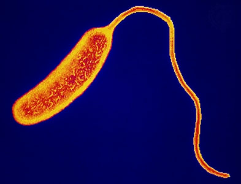
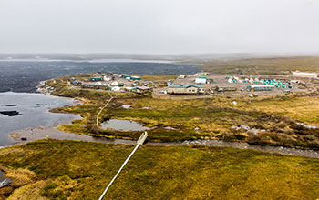
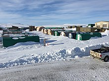
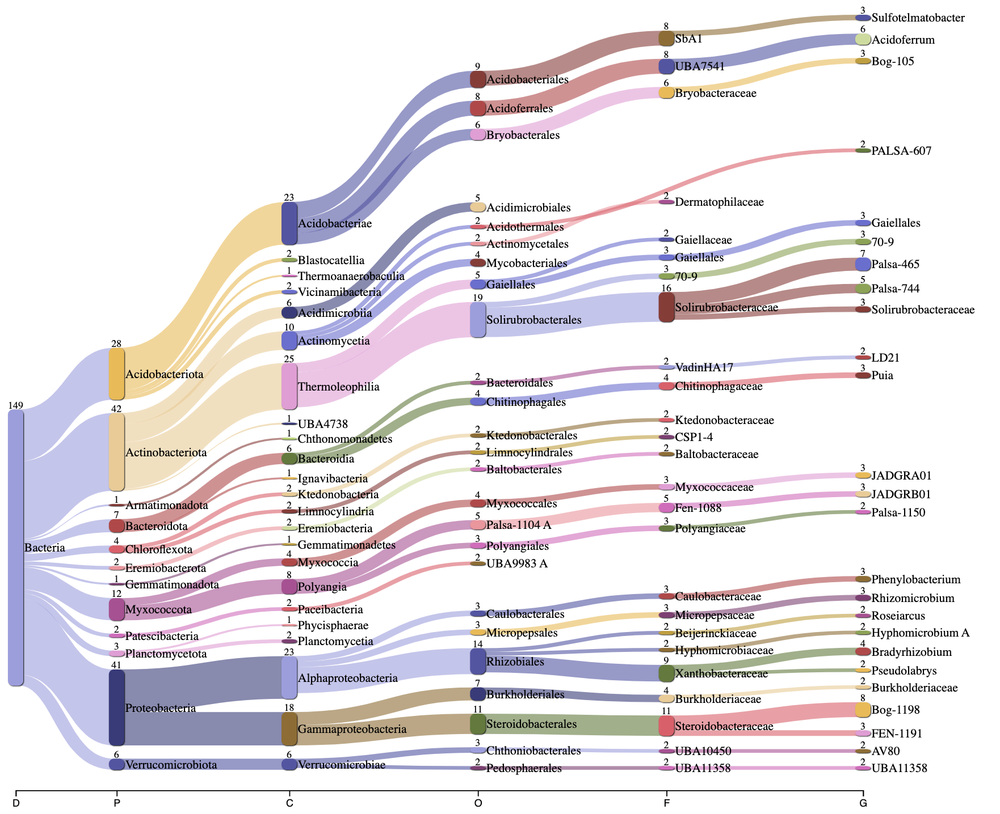
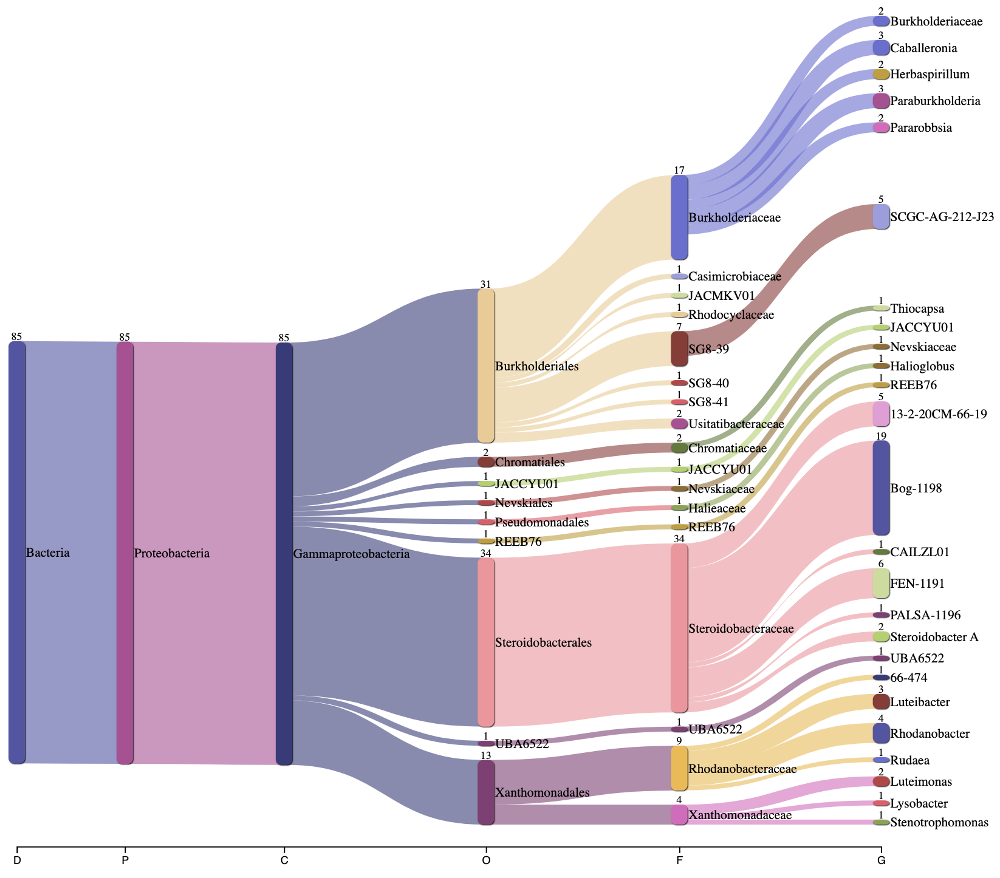
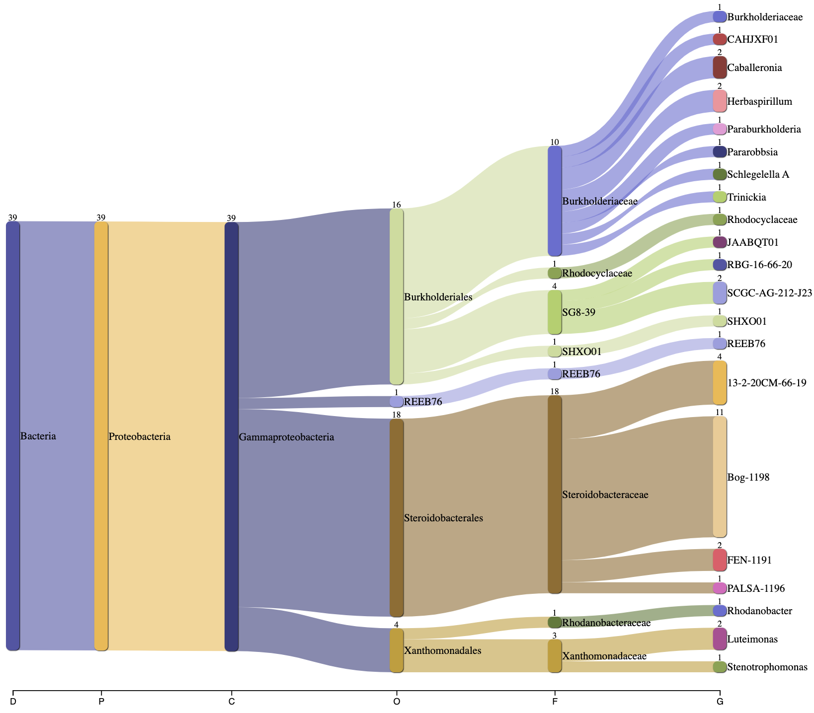

```{r, echo=FALSE, message=FALSE, warning=FALSE}
if (!require("BiocManager", quietly = TRUE))
    install.packages("BiocManager")

BiocManager::install("treeio")
BiocManager::install("ggtreeExtra")
```

```{r, echo=FALSE, message=FALSE, warning=FALSE}
library(tidyverse)
library(ggplot2)
library(zoo)
library(knitr)
library(ggtree)
library(ggimage)
library(rphylopic)
library(treeio)
library(tidytree)
library(ape)
library(TreeTools)
library(phytools)
library(TDbook)
library(ggnewscale)
library(ggtreeExtra)
library(ggstar)
library(plotly)
```

```{r, echo=FALSE}
tree_bac <- read.tree("data/NEON/gtdbtk.bac120.decorated.tree")
```

# Abstract

  Soil microbiome research and characterization is an important field of microbiology for its industrial applications and ability to advance biological knowledge. In this project, NEON metagenomic sequencing data from Toolik Field Station and for the class Gammaproteobacteria was analyzed to characterize the soil microbiome under these two conditions. Phylogenetic visualizations, taxonomic summary graphs, and graphs incorporating environmental data were generated to look for interesting patterns in the data. Findings support the fact that Gammaproteobacteria is an extremely diverse class and analysis of its abundant Burkholderiales order revealed it has five novel genera. Findings from Toolik revealed mostly expected groups present but some lower abundance groups that are uncharacterized like the biogeochemically relevant Armatimonadota. 

# Motivation

  Microbiology as a discipline is relatively young and with omics approaches exploding in only the last 15 years, we have really just begun to capture the full extent of microbial diversity. Metagenomic analyses of soil microbial communities suggest that the majority of microbes exist in low abundance in the environment and are unculturable. Because of this we rely on metagenomic studies like the NEON project to discover and characterize new microbial life.
  
  Soil microbes have countless practical applications. From biofertilizer development to the bioremediation of heavy metal pollutants to the synthesis of antibiotics with pharmaceutical applications; the soil microbiome truly has countless applications that greatly improve our quality of life. Besides these practical reasons it is also beneficial to study novel soil microbes because many of them exhibit strange lifestyles that push the boundaries of what is traditionally considered to be life. Understanding these unique metabolisms will further our scientific knowledge and may provide insights into other important biological phenomena.

# Introduction

  Gammaproteobacteria is a large and well-characterized class within the Pseudomonadota phylum (considered the predominant bacterial phylum). Members of this class are gram-negative, can have a wide range of cell morphologies (cocci, rods, spirilla etc.), and occupy diverse environments (terrestrial, aquatic, and excitingly hydrothermal vents). Mirroring this heterogeneity, their lifestyles can be everything from free living to obligate symbionts, their metabolisms can be aerobic or anaerobic, and they can exhibit cool functions like magnetotaxis and bioluminescence [@lefevre_novel_2012], [@scott_genome_2006].
  
  Diverse is an understatement when it comes to this class. In their respective environments they occupy virtually every type of niche imaginable. Notable Gammaproteobacteria include human pathogens like Pseudomonas aeruginosa, Salmonella enterica, and Vibrio cholorae; ecologically relevant bacteria like bacterioplankton, methanotrophs, and nitrite-oxidizers [@williams_phylogeny_2010]. Some Gammaproteobacteria have important applications like oil spill and industrial waste remediation in oceans [@cao_photosynthetic_2020]. Overall this is a rich, well-characterized class of bacteria known to have many different lifestyles; however, considering how only a fraction of bacterial species have been cultured and studied in the lab there is likely still a lot of untapped diversity within this phylum that is worth exploring.

  Toolik Field Station is an NSF funded LTER station managed by the Institute of Arctic Biology at the University of Alaska Fairbanks. It is located on the southeast shore of Toolik Lake just north of the infamous Brook’s Range [@noauthor1_toolik_nodate]. Toolik experiences long cold winters (-40 C) without sunlight and short summers with 24/7 sunlight. Mean yearly temperature is -9 C. Rolling till plains and moraines dominate the landscape. Soils have a high organic matter content (cold temperatures limit decomposition), are usually saturated, and contain permafrost year round. Tussock tundra and low shrubs are the most abundant vegetation. The land is largely undisturbed and home to diverse wildlife. A wide range of both aquatic and terrestrial ecology research takes place at the station [@noauthor2_toolik_nodate].











# Methods

  To learn more about Toolik Field Station and Gammaproteobacteria, my group decided to separate our data analysis into three parts. The first would be all bacteria found at Toolik Field Station, the second is Gammaproteobacteria at all NEON field sites, and the third is Gammaproteobacteria at just Toolik Field Station. Using the collected NEON metagenomic data, we created phylogenetic trees and summary graphs to analyze our field site and bacterial group with the goal of identifying interesting trends in the data.. 


```{r, echo=FALSE, message=FALSE, warning=FALSE}
NEON_MAGs <- read_csv("data/NEON/GOLD_Study_ID_Gs0161344_NEON_2024_4_21.csv") %>% 
  # remove columns that are not needed for data analysis
  select(-c(`GOLD Study ID`, `Bin Methods`, `Created By`, `Date Added`, `Bin Lineage`)) %>% 
  # create a new column with the Assembly Type
  mutate("Assembly Type" = case_when(`Genome Name` == "NEON combined assembly" ~ `Genome Name`,
                            TRUE ~ "Individual")) %>% 
  mutate_at("Assembly Type", str_replace, "NEON combined assembly", "Combined") %>% 
  mutate_at("GTDB-Tk Taxonomy Lineage", str_replace, "d__", "") %>%  
  mutate_at("GTDB-Tk Taxonomy Lineage", str_replace, "p__", "") %>% 
  mutate_at("GTDB-Tk Taxonomy Lineage", str_replace, "c__", "") %>% 
  mutate_at("GTDB-Tk Taxonomy Lineage", str_replace, "o__", "") %>% 
  mutate_at("GTDB-Tk Taxonomy Lineage", str_replace, "f__", "") %>% 
  mutate_at("GTDB-Tk Taxonomy Lineage", str_replace, "g__", "") %>% 
  mutate_at("GTDB-Tk Taxonomy Lineage", str_replace, "s__", "") %>%
  separate(`GTDB-Tk Taxonomy Lineage`, c("Domain", "Phylum", "Class", "Order", "Family", "Genus", "Species"), ";", remove = FALSE) %>% 
  mutate_at("Domain", na_if,"") %>% 
  mutate_at("Phylum", na_if,"") %>% 
  mutate_at("Class", na_if,"") %>% 
  mutate_at("Order", na_if,"") %>% 
  mutate_at("Family", na_if,"") %>% 
  mutate_at("Genus", na_if,"") %>% 
  mutate_at("Species", na_if,"") %>% 
  
  # Get rid of the the common string "Soil microbial communities from "
  mutate_at("Genome Name", str_replace, "Terrestrial soil microbial communities from ", "") %>% 
  # Use the first `-` to split the column in two
  separate(`Genome Name`, c("Site","Sample Name"), " - ") %>% 
  # Get rid of the the common string "S-comp-1"
  mutate_at("Sample Name", str_replace, "-comp-1", "") %>%
  # separate the Sample Name into Site ID and plot info
  separate(`Sample Name`, c("Site ID","subplot.layer.date"), "_", remove = FALSE,) %>% 
  # separate the plot info into 3 columns
  separate(`subplot.layer.date`, c("Subplot", "Layer", "Date"), "-") 
```

```{r, echo=FALSE, message=FALSE, warning=FALSE}
NEON_metagenomes <- read_tsv("data/NEON/exported_img_data_Gs0161344_NEON.tsv") %>% 
  select(-c(`Domain`, `Sequencing Status`, `Sequencing Center`)) %>% 
  rename(`Genome Name` = `Genome Name / Sample Name`) %>% 
  filter(str_detect(`Genome Name`, 're-annotation', negate = T)) %>% 
  filter(str_detect(`Genome Name`, 'WREF plot', negate = T)) 
```

```{r, echo=FALSE, message=FALSE, warning=FALSE}
NEON_metagenomes <- NEON_metagenomes %>% 
  # Get rid of the the common string "Soil microbial communities from "
  mutate_at("Genome Name", str_replace, "Terrestrial soil microbial communities from ", "") %>% 
  # Use the first `-` to split the column in two
  separate(`Genome Name`, c("Site","Sample Name"), " - ") %>% 
  # Get rid of the the common string "-comp-1"
  mutate_at("Sample Name", str_replace, "-comp-1", "") %>%
  # separate the Sample Name into Site ID and plot info
  separate(`Sample Name`, c("Site ID","subplot.layer.date"), "_", remove = FALSE,) %>% 
  # separate the plot info into 3 columns
  separate(`subplot.layer.date`, c("Subplot", "Layer", "Date"), "-") 
```

```{r, echo=FALSE, message=FALSE, warning=FALSE}
NEON_chemistry <- read_tsv("data/NEON/neon_plot_soilChem1_metadata.tsv") %>% 
  # remove -COMP from genomicsSampleID
  mutate_at("genomicsSampleID", str_replace, "-COMP", "") 
```

```{r, echo=FALSE, message=FALSE, warning=FALSE}
NEON_MAGs_metagenomes_chemistry <- NEON_MAGs %>% 
  left_join(NEON_metagenomes, by = "Sample Name") %>% 
  left_join(NEON_chemistry, by = c("Sample Name" = "genomicsSampleID"))
```

```{r, echo=FALSE, message=FALSE}
# Getting rid of coassembly data
NEON_MAGs_indv <- NEON_MAGs %>% 
filter(`Assembly Type` == "Individual")
```

```{r, echo=FALSE, message=FALSE}
# Getting rid of individual assembly data
NEON_MAGs_co <- NEON_MAGs %>% 
filter(`Assembly Type` == "Combined")
```

# Exploring Toolik Field Station

```{r, echo=FALSE}
NEON_MAGs_metagenomes_chemistry_TOOL <- NEON_MAGs_metagenomes_chemistry %>% 
  filter(`Site ID.x` == "TOOL")
```


```{r, echo=FALSE}
NEON_MAGs_TOOL <- NEON_MAGs %>% 
  filter(`Site ID` == "TOOL")

NEON_metagenomes_TOOL <- NEON_metagenomes %>% 
  filter(`Site ID` == "TOOL")

NEON_chemistry_TOOL <- NEON_chemistry %>% 
  filter(`siteID` == "TOOL")
```

## Phylogeny 


### Sankey Plot Visualization




### ggtree Visualizations
```{r, echo=FALSE, warning=FALSE}
TOOL_MAGs_label <- NEON_MAGs_metagenomes_chemistry_TOOL$`Bin ID`
```

```{r, echo=FALSE}
tree_bac_TOOL_MAGs <-drop.tip(tree_bac,tree_bac$tip.label[-match(TOOL_MAGs_label, tree_bac$tip.label)])
```

```{r, echo=FALSE, fig.width=10}
ggtree(tree_bac_TOOL_MAGs, layout="circular")  %<+%
  NEON_MAGs_metagenomes_chemistry +
  geom_point(mapping=aes(color=Phylum)) 
```

Figure 2. An overview of the phylogenetic relationships between all phyla present at Toolik Filed Station. The most abundant groups, Acidobacteria, Pseudomonadota, and Actinomycetota are all known to dominate soil environments.


```{r, echo=FALSE, warning=FALSE, fig.width=15}
ggtree(tree_bac_TOOL_MAGs, layout="circular")  %<+%
  NEON_MAGs_metagenomes_chemistry + 
  geom_point2(mapping=aes(color= `Bin Completeness`, size=`Total Number of Bases`))
```

Figure 3. Phylogenetic tree showing relationship between bin completeness and total number of base pairs. The largest MAGs appear to be the most complete while smaller MAGs are less complete. This may be the result of 1. the bins actually being incomplete or 2. binning programs labelling obligate symbionts as being incomplete because they lack key genes necessary for life.

## Taxonomic Breakdown  

```{r, echo=FALSE}
NEON_MAGs_TOOL %>% 
  ggplot(aes(x = fct_infreq(Phylum))) +
    geom_bar() +
    coord_flip() +
    xlab("Phylum") +
    ylab("Number of MAGs") +
    ggtitle("Number of MAGs per Phylum at Toolik")
```

Figure 4. Phyla present at Toolik Field Station. There are 12 total phyla present. The most abundant phyla are all known to dominate soil. There are lesser characterized phyla present in lower abundance like Patescibacteria (unculturable nanobacteria) and the ecologically relevant Armatimonadota that can degrade complex carbohydrates. Specifically our class of focus Gammaproteobacteria is within the Pseudomonadota phylum.


```{r, echo=FALSE, fig.width=12}
NEON_MAGs_TOOL %>% 
ggplot(aes(x = fct_rev(fct_infreq(Phylum)), fill = Class)) +
  geom_bar() +
  coord_flip() +
  xlab("Phylum") +
  ylab("Number of MAGs") +
  ggtitle("Number of MAGs per Phylum at Toolik")
```

Figure 5. All phyla present at Toolik colored by Order. Notably, Gammaproteobacteria comprises around half of all Psuedomontada. 


```{r, echo=FALSE, fig.width=12}
NEON_MAGs_TOOL %>% 
  ggplot(aes(x = fct_rev(fct_infreq(Class)), fill = Order)) +
  geom_bar() +
  coord_flip() +
  xlab("Class") +
  ylab("Number of MAGs") +
  ggtitle("Number of MAGs per Class at Toolik")
```

Figure 6. Classes present at Toolik Field Station. A total of 18 Gammaproteobacteria are present at the site. It is slightly less abundant than Alphaproteobacteria, the other class within its phylum.


```{r, echo=FALSE}
ggplotly(NEON_MAGs_TOOL %>% 
ggplot(aes(x = fct_rev(fct_infreq(Phylum)), y = `Total Number of Bases`, color = `Class`)) +
  geom_point() +
  coord_flip() +
  xlab("Phylum") +
  ylab("MAG Size (base pairs)") +
  ggtitle("MAG Size per Phylum at Toolik")
)
```

Figure 7. MAG size per phylum at Toolik. Most MAGs are between 2 and 5 Mb. There are some phyla that are outside the normal distribution. Specifically there are two Patescibacteria MAGs below 1 Mb, two Planctomycetota MAGs around and above 8 Mb and two Pseudomonadota MAGs around and above 8 Mb. Pseudomonadota has a particularly wide range of genome sizes ranging from around 1.2 Mb to 8.5 Mb. Alphaproteobacteria are larger on average than Gammaproteobacteria.


```{r, echo=FALSE, fig.width=8}
NEON_MAGs_TOOL1 <- NEON_MAGs_TOOL %>%
  mutate(Phylum = as.factor(Phylum))

NEON_MAGs_TOOL1 %>%
  ggplot(aes(x = `Gene Count`, y = `Total Number of Bases`, color = Phylum)) +
  geom_point() +
  coord_flip() +
  geom_jitter() +
  xlab("Gene Count") + 
  ylab("MAG Size (base pairs)") +
  ggtitle("Relationship Between MAG Size and Gene Count at Toolik")
```

Figure 8. The relationship between MAG size and gene counts for all MAGs at Toolik. Colored by phylum to once again display avergae sizes of the phyla present at Toolik. There is a clearly positive relationship between genome size and number of genes present which is expected.


```{r, echo=FALSE, fig.width=8}
NEON_MAGs_TOOL1 <- NEON_MAGs_TOOL %>%
  mutate(Phylum = as.factor(Phylum))

NEON_MAGs_TOOL1 %>%
  ggplot(aes(x = `Bin Completeness`, y = `Total Number of Bases`, color = Phylum)) +
  geom_point() +
  coord_flip() +
  geom_jitter() +
  xlab("MAG Completeness") + 
  ylab("MAG Size (base pairs)") +
  ggtitle("Relationship Between MAG Size and Completeness at Toolik")
```

Figure 9. Relationship between MAG size and completeness colored by phylum. There is no obvious positive correlation between MAG size and completion, although the least complete MAGs around 50% are all on the smaller side. 


## Environmental Factors 

### pH

```{r, echo=FALSE}
NEON_MAGs_metagenomes_chemistry_TOOL %>% 
ggplot(aes(x = fct_rev(fct_infreq(Phylum)), y = soilInWaterpH, color = Phylum)) +
  geom_boxplot() +
  coord_flip() +
  xlab("Phylum") +
  ylab("Soil pH in Water") +
  ggtitle("Relationship Between Soil pH and Phyla Present at Toolik")
```

Figure 10. Soils at Toolik are acidic ranging from 4.8 - 6.2. There are many phyla enriched at acidic pHs like Pseudomonadota, Acidobacteriota, Myxococcota, and Verrucomicrobiola. There are also phyla present in soils of all pHs like Actinomycetota and Bacteroidota. Overall all MAGs at Toolik are growing in acidic conditions,


### Soil Temperature

```{r, echo=FALSE}
NEON_MAGs_metagenomes_chemistry_TOOL %>% 
ggplot(aes(x = fct_rev(fct_infreq(Phylum)), y = soilTemp)) +
  geom_boxplot() +
  coord_flip() +
  xlab("Phylum") +
  ylab("Soil Temperature (Celsius)") +
  ggtitle("Relationship Between Soil Temperature and Phyla Present at Toolik")
```

Figure 11. Soils at Toolik are of low temperatures, ranging from 2 - 8 °C. Most bacteria at Toolik are most abundant around 5 °C. There are some phyla that favor higher temperatures from 7 - 8 °C like Planctomycetota while there are others that favor lower temperatures from 3 - 4.5 °C like Pseudomonadota.


```{r, echo=FALSE}
NEON_MAGs_metagenomes_chemistry_TOOL %>% 
ggplot(aes(x = soilInWaterpH, y = soilTemp, color = Subplot.y)) +
  geom_point() +
  coord_flip() +
  xlab("Soil pH in Water") +
  ylab("Soil Temperature (Celsius)") +
  ggtitle("Relationship Between Soil Temperature and Soil pH per Subplot at Toolik")
```

Figure 12. There is no direct correlation between soil pH and temperature. Most subplots sampled have acidic pHs from 5 - 5.4 and low temperatures from 2 - 4 °C. Three subplots sampled have higher temperatures at and over 8 °C.


### Elevation

```{r, echo=FALSE}
NEON_MAGs_metagenomes_chemistry_TOOL %>% 
ggplot(aes(x = fct_rev(fct_infreq(Phylum)), y = elevation)) +
  geom_boxplot() +
  coord_flip() +
  xlab("Phylum") +
  ylab("Elevation (m)") +
  ggtitle("Relationship Between Elevation and Phyla Present at Toolik")
```

Figure 13. There is no major relationship between the phyla present and elevation of the soil sample. Interestingly, abundant groups have different relationships with elevation. For example, the abundant phylum Actinomycetota has a wide range of elevations whereas the second most abundant phylum Pseudomonadota has a very small range of elevations it is observed at. Furthermore, 


### Land Cover Type

```{r, echo=FALSE, fig.width=15}
NEON_MAGs_metagenomes_chemistry_TOOL %>% 
   ggplot(aes(x=`Phylum`, fill=Class)) +
  geom_bar() +
  coord_flip() +
  facet_wrap(vars(nlcdClass), scales="free_y", ncol=3) +
  labs(title="Relationship Between National Land Cover Type and Phyla Present at Toolik", x= "Phylum", y="Number of MAGs") +  
  theme_classic()
```

Figure 14. The distribution of phyla between the three different national land cover types. Dwarf shrubs are shrubs under 20 cm tall, shrub scrubs are shrubs under 5 meters tall where the overall vegetation is at least 20% shrub, and sedge herbaceous are areas composed of at least 80% sedges and forbs. The two most abundant phyla, Acidobacteriota and Pseudomonadota, are significantly less prevalent in shrub scrubs than other land cover types. Within Pseudomonadota, Gammaproteobacteria is more prevelant in shrub scrubs and Alphaproteobacteria is more prevelant in dwarf shrubs.


# Exploring Gammaproteobacteria 


```{r, echo=FALSE}
NEON_MAGs_metagenomes_chemistry_gamma <- NEON_MAGs_metagenomes_chemistry %>% 
  filter(str_detect(`Class`, "Gammaproteobacteria")) %>% 
  filter(`Assembly Type` == "Individual")
```


## Phylogeny 

### Sankey Plot Visualizations






### ggtree Visualization

```{r, echo=FALSE, warning=FALSE}
gamma_MAGs_label <- NEON_MAGs_metagenomes_chemistry_gamma$`Bin ID`
```

```{r, echo=FALSE}
tree_bac_gamma_MAGs <-drop.tip(tree_bac,tree_bac$tip.label[-match(gamma_MAGs_label, tree_bac$tip.label)])
```

```{r, echo=FALSE, message=FALSE}
# Make a vector with the internal node labels
node_vector_bac_gamma = c(tree_bac_gamma_MAGs$tip.label,tree_bac_gamma_MAGs$node.label)

# Search for your Phylum or Class to get the node
grep("Burkholderiales", node_vector_bac_gamma, value = TRUE)
```

```{r, echo=FALSE, message=FALSE}
match(grep("Burkholderiales", node_vector_bac_gamma, value = TRUE), node_vector_bac_gamma)
```
```{r, echo=FALSE, message=FALSE}
grep("Steroidobacterales", node_vector_bac_gamma, value = TRUE)
```
```{r, echo=FALSE, message=FALSE}
match(grep("Steroidobacterales", node_vector_bac_gamma, value = TRUE), node_vector_bac_gamma)
```
```{r, echo=FALSE, message=FALSE}
grep("Xanthomonadales", node_vector_bac_gamma, value = TRUE)
```
```{r, echo=FALSE, message=FALSE}
match(grep("Xanthomonadales", node_vector_bac_gamma, value = TRUE), node_vector_bac_gamma)
```

```{r, echo=FALSE}
ggtree(tree_bac_gamma_MAGs, layout="circular", branch.length="none") +
  
    geom_hilight(node=87, fill="lightblue", alpha=.6) +
    geom_cladelab(node=87, label="Burkholderiales", align=TRUE, hjust=-0.3, offset = 0, textcolor='lightblue', barcolor='lightblue') +

    geom_hilight(node=124, fill="lightgreen", alpha=.6) +
    geom_cladelab(node=124, label="Steroidobacterales", align=TRUE, vjust=1.5, offset = 0, textcolor='lightgreen', barcolor='lightgreen') +
  
      geom_hilight(node=158, fill="violet", alpha=.6) +
    geom_cladelab(node=158, label="Xanthomonadales", align=TRUE, hjust=1.1, offset = 0, textcolor='violet', barcolor='violet') 
```

Figure 17. Phylogenetic tree of the three major Gammaproteobacteria orders present in the NEON data. The most abundant order is Steroidobacterales, the second most abundant is Burkholderiales, and the third most abundant is Xanthomonadales. Burkholderiales is the msot phylogenetically distinct among the three orders as it forms its own clade at the highest level on the tree.


```{r, echo=FALSE, warning=FALSE, fig.width=15}
NEON_MAGs_metagenomes_chemistry_burk <- NEON_MAGs_metagenomes_chemistry_gamma %>% 
   filter(`Order` == "Burkholderiales") %>% 
  filter(`Assembly Type` == "Individual")

burk_MAGs_label <- NEON_MAGs_metagenomes_chemistry_burk$`Bin ID`

tree_bac_burk_MAGs <-drop.tip(tree_bac,tree_bac$tip.label[-match(burk_MAGs_label, tree_bac$tip.label)])
```

```{r, echo=FALSE, warning=FALSE, fig.height=5, fig.width=8}
ggtree(tree_bac_burk_MAGs, layout="circular")  %<+%
  NEON_MAGs_metagenomes_chemistry + 
 geom_point2(mapping=aes(color= `Family`, size=`Total Number of Bases`))
```

Figure 18. Phylogenetic tree of the abundant and diverse Burkholderiales order. The dominant family is Burkholderiaceae which has its own subfamilies and forms its own clade spanning most of the tree. The remaining adjacent clade is comprised of many different families at low abundance.

## Taxonomic Breakdown 


```{r, echo=FALSE, fig.width=10}
NEON_MAGs_metagenomes_chemistry_gamma %>% 
ggplot(aes(x = fct_rev(fct_infreq(Order)), fill = Site.x)) +
  geom_bar() +
  coord_flip() +
  xlab("Orders") +
  ylab("Number of MAGs") +
  ggtitle("Numbers of Gammaproteobacteria by Order")
```

Figure 19. The numbers of Gammaproteobacteria MAGs per order. This is colored by site. There are three orders that dominate the Gammaproteobacteria in the NEON data. There are 6 significantly less abundant orders that only show up at 1 site each. 


```{r, echo=FALSE, fig.height=11, fig.width=11}
NEON_MAGs_metagenomes_chemistry_gamma %>% 
ggplot(aes(x = Order, fill = Family)) +
  geom_bar(position = position_dodge2(width = 0.9, preserve = "single")) +
  coord_flip() +
  facet_wrap(vars(Site.x), scales = "free", ncol = 2) +
  xlab("Orders") +
  ylab("Number of MAGs") +
  ggtitle("Numbers of Gammaproteobacteria by Order in Each Site")
```

Figure 20. The numbers of Gammaproteobacteria orders per site colored by family. Once again out of all orders, Burkholderiales continues to be the most diverse at the family level and widespread within all of the sites sampled.


```{r, echo=FALSE, fig.width=9, fig.height=7}
NEON_MAGs_metagenomes_chemistry_gamma %>% 
ggplot(aes(x = fct_rev(fct_infreq(Order)), fill = Family)) +
  geom_bar(position = position_dodge2(width = 0.9, preserve = "single")) +
  coord_flip() +
  xlab("Orders") +
  ylab("Number of MAGs") +
  ggtitle("Numbers of Gammaproteobacteria by Order")
```

Figure 21. The numbers of Gammaproteobacteria MAGs per order. This is colored by family. Interestingly all members of the most abundant order are of the same family whereas the second most abundant order has a 10 different orders. This is likely because most/ all members of Steroidobacterales are of the same family.


```{r, echo=FALSE}
ggplotly(
  NEON_MAGs_metagenomes_chemistry_gamma %>%
  filter(is.na(Order) | is.na(Family) | is.na(Genus)) %>%
  ggplot(aes(x = Order, fill = Family)) +
  geom_bar() +
  coord_flip() +
  guides(fill = "none") +
  labs(
    title = "Orders of Gammaproteobacteria with Novel Bacteria",
    x = "Order",
    y = "Number of Novel Bacteria"
  )
)
```

Figure 22. The number of novel Gammaproteobacteris present int he data set. The second most abundant order, Burkholderiales, has the highest number of novel MAGs.


```{r, echo=FALSE}
ggplotly(NEON_MAGs_metagenomes_chemistry_gamma %>% 
ggplot(aes(x = fct_rev(fct_infreq(Order)), y = `Total Number of Bases`, color = `Family`)) +
  geom_point() +
  coord_flip() +
  xlab("Order") +
  ylab("MAG Size (base pairs)") +
  ggtitle("MAG Size per Order in Gammaproteobacteria")
)
```

Figure 23. Overview of MAG Size of Gammaproteobacteria. Once again we see a few orders dominate. There are a relatively wide range of genome sizes in these orders from under 2 Mb to 7/8 Mb. As expected the least abundant MAGs all have smaller genomes.


### Burkholderiales Taxonomy

```{r, echo=FALSE, fig.height=5}
NEON_MAGs_metagenomes_chemistry_burk %>% 
  ggplot(aes(x = fct_rev(fct_infreq(Family)), fill = Genus)) +
  geom_bar() +
  coord_flip() +
  xlab("Families") +
  ylab("Number of MAGs") +
  ggtitle("Number of Burkholderiales by Family")
```

Figure 24. Taxonomic breakdown of the Burkholderiales order. Burkholderiaceae is by far the most abundant family, having two subfamilies and many genera. Four Burkholderiales families are comprised entirely of novel genera. Overall this is an order with many novel MAGs compared to the other orders in Gammaproteobacteria.


```{r, echo=FALSE, fig.height=5}
NEON_MAGs_metagenomes_chemistry_burk %>% 
  ggplot(aes(x = fct_rev(fct_infreq(Family)), y = `Total Number of Bases`, color = Genus)) +
  geom_point() +
  coord_flip() +
  xlab("Families") +
  ylab("MAG Size (base pairs)") +
  ggtitle("MAG Size of Burkholderiales by Family")
```

Figure 25. Here MAG size by family shows that the most abundant family Burkholderiaceae has a wide range of genome sizes, with most being on the larger size. As expected the least abundant MAGs all have smaller genomes.


```{r, echo=FALSE, fig.width=10}
NEON_MAGs_metagenomes_chemistry_burk %>% 
  ggplot(aes(x = fct_rev(fct_infreq(Genus)), fill = Site.x)) +
  geom_bar() +
  coord_flip() +
  xlab("Genus") +
  ylab("Number of MAGs") +
  ggtitle("Genera in  Burkholderiales")
```

Figure 26. Most genera in Burkholderiales are only associated with one MAG and five are novel. The most abundant genus is SCGC-AG-212-J23 which is in a similarly alphanumerically named family. Overall all of these genera are relatively unknown and recently disovered via metagenomic sequencing.


## Environmental Factors Influencing Gammaproteobacteria

### pH

```{r, echo=FALSE}
NEON_MAGs_metagenomes_chemistry_gamma %>% 
ggplot(aes(x = fct_rev(fct_infreq(Order)), y = soilInWaterpH)) +
  geom_boxplot() +
  coord_flip() +
  xlab("Order") +
  ylab("Soil pH in Water") +
  ggtitle("Relationship Between Soil pH and Orders in Gammaproteobacteria")
```

Figure 27. There appears to be no strong relationship between any given order and pH of the soil. Overall Xanthomonadales and Steroidobacterales both prefer acidic soils with pH around 5. Interestingly there is one outlier in Xanthomonadales growing in a strong neutral pH around 9.

### Temperature

```{r, echo=FALSE}
NEON_MAGs_metagenomes_chemistry_gamma %>% 
ggplot(aes(x = fct_rev(fct_infreq(Order)), y = soilTemp)) +
  geom_boxplot() +
  coord_flip() +
  xlab("Order") +
  ylab("Temperature (Celsius)") +
  ggtitle("Relationship Between Temperature and Orders in Gammaproteobacteria")
```

Figure 28. More abundant orders clearly prefer colder temperatures. This is expected as field site where this class was most abundant was Toolik where soils are generally cold year round. The most abundant order has a particularly wide range of temperatures it grows in rainging from nearly 0 °C to 37 °C.


```{r, echo=FALSE}
NEON_MAGs_metagenomes_chemistry_gamma %>%
  ggplot(aes(x = `soilTemp`, y = `soilInWaterpH`, color = Order)) +
  geom_point() +
  coord_flip() +
  geom_jitter() +
  xlab("Temperature (Celsius)") + 
  ylab("Soil pH in Water") +
  ggtitle("Relationship Between Temperature and Soil pH in Gammaproteobacteria")
```

Figure 29. Many Gammaproteobacteria MAGs cluster in the bottom left corner of the graph indicating they grow in colder temperatures (below 10 °C) and acidic pH's (under 5.5). 


### Elevation

```{r, echo=FALSE, fig.width=8}
NEON_MAGs_metagenomes_chemistry_gamma1 <- NEON_MAGs_metagenomes_chemistry_gamma %>%
  mutate(Order = as.factor(Order))

NEON_MAGs_metagenomes_chemistry_gamma1 %>%
  ggplot(aes(x = `soilTemp`, y = `Elevation In Meters`, color = Order)) +
  geom_point() +
  coord_flip() +
  geom_jitter() +
  xlab("Temperature (Celsius)") + 
  ylab("Elevation (m)") +
  ggtitle("Relationship Between Temperature and Elevation in Gammaproteobacteria")
```

Figure 30. Many Gammaproteobacteria MAGs cluster in the bottom left corner of the graph indicating they grow in lower elevations at colder temperatures. This is likely due to more sampling being done at those lower elevations. 


### Ecosystem Type

```{r, echo=FALSE, fig.width=9}
NEON_MAGs_metagenomes_chemistry_gamma %>% 
ggplot(aes(x = `Ecosystem Subtype`, y = soilTemp, color = Order)) +
  geom_point() +
  coord_flip() +
  xlab("Ecosystem Subtype") +
  ylab("Temperature (Celsius)") +
  ggtitle("Relationship Between Temperature and Ecosystem Subtype in Gammaproteobacteria")
```

Figure 31. Overall, Gammaproteobacteria MAGs are more prevalent in Temperate Forests and Tundra ecosystems. This is likely because these ecosystem types were sampled more frequently. The most abundant orders are ubiqiutous among all of the ecosystem subtypes. Xanthomonadales is one of the most abundant orders and it was the only order to grow in the desert which makes sense as it can also tolerate higher temperatures.


# Exploring Gammaproteobacteria at Toolik Field Station

```{r, echo=FALSE}
NEON_MAGs_metagenomes_chemistry_gammaTOOL <- NEON_MAGs_metagenomes_chemistry_TOOL %>% 
  filter(str_detect(`Class`, "Gammaproteobacteria"))
```

## Phylogeny of Gammaproteobacteria at Toolik 

```{r, echo=FALSE, warning=FALSE, fig.width=15}
gammatool_MAGs_label <- NEON_MAGs_metagenomes_chemistry_gammaTOOL$`Bin ID`

tree_bac_gammatool_MAGs <-drop.tip(tree_bac,tree_bac$tip.label[-match(gammatool_MAGs_label, tree_bac$tip.label)])
```

```{r, echo=FALSE, warning=FALSE}
ggtree(tree_bac_gammatool_MAGs, layout="rectangular", branch.length = "none")  %<+%
  NEON_MAGs_metagenomes_chemistry + 
 geom_point2(mapping=aes(color= `Family`, size=`Total Number of Bases`)) 
```

Figure 32. At Toolik the 2 Gammaproteobacteria orders that are present are the Burkholderiales and Steroidobacterales which are the two most prevelant orders. Genome size is very consistent besides one very small (under 2Mb) Steroidobacterales outlier. Burkholderiales is once again diverse at the family level.


## Taxonomic Breakdown of Gammaproteobacteria at Toolik Field Station

```{r, echo=FALSE}
NEON_MAGs_metagenomes_chemistry_gammaTOOL %>% 
ggplot(aes(x = fct_rev(fct_infreq(Family)), fill = Genus)) +
  geom_bar() +
  coord_flip() +
  xlab("Family") +
  ylab("Number of MAGs") +
  ggtitle("Number of Gammaproteobacteria Families at Toolik")
```

Figure 33. Overall Burkholderiales is a more taxonomically diverse order at both the family and genus level than Steroidobacterales. This holds up both at Toolik and in general within the data. Bog-1198 is the dominant genus within Steroidobacterales whereas Burkholderiaceae A is the most prevelant genus within Burkholderiales.


```{r, echo=FALSE}
NEON_MAGs_metagenomes_chemistry_gammaTOOL %>% 
  ggplot(aes(x = fct_rev(fct_infreq(Order)), y = `Total Number of Bases`)) +
  geom_boxplot() +
  coord_flip() +
  xlab("Orders") +
  ylab("MAG Size (base pairs)") +
  ggtitle("MAG Size of Gammaproteobacteria Orders at Toolik")
```

Figure 34. On average Burkholderiales MAGs have larger genomes than Steroidobacterales MAGs at Toolik. However Steroidobacterales has a much larger range of observed genome sizes. Particularly there is a MAG under 1 Mb.


```{r, echo=FALSE}
NEON_MAGs_metagenomes_chemistry_gammaTOOL1 <- NEON_MAGs_metagenomes_chemistry_gammaTOOL %>%
  mutate(Family = as.factor(Family))

NEON_MAGs_metagenomes_chemistry_gammaTOOL1 %>%
  ggplot(aes(x = `Bin Completeness`, y = `Total Number of Bases`, color = Family)) +
  geom_point() +
  coord_flip() +
  geom_jitter() +
  xlab("MAG Size (base pairs)") + 
  ylab("Bin Completeness") +
  ggtitle("Relationship Between Gammaproteobacteria MAG Size and Completeness at Toolik")
```

Figure 35. As expected on average larger MAGs have higher completeness scores than smaller MAGs. Specifically the very small Steroidobacterales MAG has a completeness under 60%. There is no relationship between a specific order or family having on average higher completeness scores.


### Burkholderiales at Toolik

```{r, echo=FALSE}
NEON_MAGs_metagenomes_chemistry_burk2 <- NEON_MAGs_metagenomes_chemistry_burk %>% 
  filter(`Site ID.x` == "TOOL") %>% 
   mutate(Family = as.factor(Family)) %>% 
  mutate(Genus = as.factor(Genus))

NEON_MAGs_metagenomes_chemistry_burk2 %>% 
ggplot(aes(x = Family, y = soilTemp, color = Genus)) +
  geom_point(size = 4) +
  coord_flip() +
  xlab("Family") +
  ylab("Temperature (Celsius)") +
  ggtitle("Temperature Impact on Burkholderiales Families at Toolik")
```

Figure 36. The diverse order Burkholderiales is mostly present at lower temperatures in Toolik likely becasue these soils are simply colder. There is one outlier in SG8-39 family which is observed growing at 8.5 °C.


## Environmental Factors at Toolik Impacts on Gammaproteobacteria


### Land Cover Type

```{r, echo=FALSE, fig.height=3, fig.width=11}
NEON_MAGs_metagenomes_chemistry_gammaTOOL %>% 
   ggplot(aes(x=`Family`, fill=Genus)) +
  geom_bar() +
  coord_flip() +
  facet_wrap(vars(nlcdClass), scales="free_y", ncol=3) +
  labs(title="Relationship Between National Land Cover Type and Phyla Present at Toolik", x= "Phylum", y="Number of MAGs") +  
  theme_classic()
```

Figure 37. Both families are equally present at all three land cover types present at Toolik. Significantly more Steroidobacteracee live in shrub scrubs and herbaceous sedges than dwarf scrubs. 


# Conclusions


## Gammaproteobacteria 

  Gammaproteobacteria are ubiqitous in the NEON data, found in thirteen different sites from very different regions. The full genome size range of Gammaproteobacteria MAGs sampled is 1.3 Mb to 7.3 Mb. Most Gammaproteobacteria grew in acidic environments under pH 6 but a few outliers from varying orders grew in neutral pHs over 8. Most Gammaproteobacteria grew in soils under 15 °C with one outlier growing above 30 °C. Most Gammaproteobacteria grew at lower elevations (below 1,000 m) and they were primarily found in temperate forest ecosystems. It is important to note with these environmental factors that more sampling in the NEON data set could simply have been done under certain conditions thus over representing MAGs.
  
  
## Burkholderiales

  Overall, three major orders (Steroidobacterales, Burkholderiales, and Xanthomonadales) make up the majority of Gammaproteobacteria within the NEON data both overall and at Toolik specifically. Burkholderiales was of particular interest as it is a well-characterized order (relative to the other two orders) and is the most taxonomically diverse and widespread orders among all of the NEON sites. This order is ubiqitous in many different natural environments and contains human pathogens and ecologically relevant members capable of nitrogen fixation and photosynthesis.
  
  Burkholderiales contains five novel MAGs at the genus level and has a wide range of genome sizes ranging from 1.6 Mb to 6.7 Mb. Apporximately half of all Burkholderiales MAGs are within the Burkholderiaceae family. This has been the most frequently observed family within the order consistently. There are 10 total different families within Burkholderiales observed in the data set. Overall, Burkholderiaceae has the widest range of MAG sizes (1.9 Mb to 7.5 Mb) and the second most abundant family SG8-39 has smaller genome sizes all under 4.5 Mb.
 
 
## Toolik Field Station
 
  Overall, Toolik Field Station hosts a wide diversity of microbes. The most abundant groups, Acidobacteria, Pseudomonadota, and Actinomycetota are all known to dominate soil environments. There are lesser characterized phyla present in lower abundance like Patescibacteria (unculturable nanobacteria) and the ecologically relevant Armatimonadota that can degrade complex carbohydrates. Most MAGs are between 2 and 5 Mb. There are some phyla that are outside the normal distribution. Specifically there are two Patescibacteria MAGs below 1 Mb, two Planctomycetota MAGs around and above 8 Mb and two Pseudomonadota MAGs around and above 8 Mb. There is a clearly positive relationship between genome size and number of genes present which is expected however there was no correlation between completeness and genome size.
  
  Soils at Toolik are acidic ranging from 4.8 - 6.2. Soils at Toolik are of low temperatures, ranging from 2 - 8 °C. Most bacteria at Toolik are most abundant around 5 °C. There is no direct correlation between soil pH and temperature. Most subplots sampled have acidic pHs from 5 - 5.4 and low temperatures from 2 - 4 °C. Three subplots sampled have higher temperatures at and over 8 °C. There is no direct correlation between soil pH and temperature. The three land cover types at Toolik are dwarf shrubs (shrubs under 20 cm tall), shrub scrubs (shrubs under 5 meters tall where the overall vegetation is at least 20% shrub), and sedge herbaceous (areas composed of at least 80% sedges and forbs). The two most abundant phyla, Acidobacteriota and Pseudomonadota, are significantly less prevalent in shrub scrubs than other land cover types.


# ReferencesEvoGeno Project
